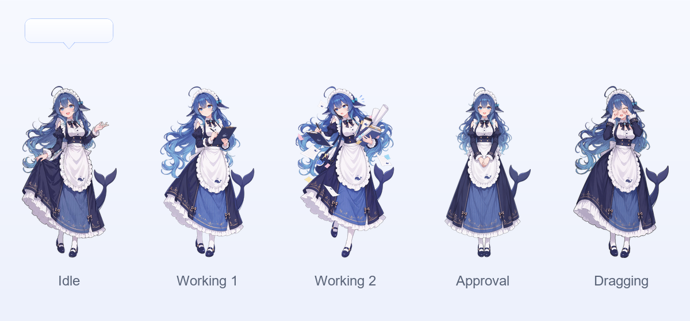

# DeskWhale

English | [中文](README.zh.md)

DeskWhale (鲸灵) is a community fork of [DeepSeek Harness](https://github.com/deepseek-ai/deepseek-harness) (MIT License) that adds a desktop pet, a frosted-glass frameless window, and a startup splash to the original agent harness.

> Unofficial fork: compatible with DeepSeek Harness, but not synchronized with or endorsed by the upstream project.



## Added features

- Desktop pet: a transparent, always-on-top whale that mirrors the dsh task status in real time
- Status bubble: distinct bubbles and poses for idle, working, tool calls, approvals, and questions
- Review reminder: the pet enters a waiting pose and shows an action button when your approval or answer is needed
- Frosted glass window: frameless main window with Windows 11 Acrylic material
- Startup splash: immediate feedback during cold start so the app never looks frozen
- Pet toggle: switch the pet on or off from the title bar, synced with the tray menu
- Draggable pet with a right-click menu; double-click opens the main window

## Run

### From source

```sh
git clone https://github.com/Rewmington/deskwhale-harness.git
cd deepseek-harness-gui
pnpm install
pnpm run build
pnpm dsh web
```

### Desktop app (Windows)

```sh
cd apps/desktop
pnpm run build
pnpm run pack:dir
```

The packaged app is at `apps/desktop/release/win-unpacked/DeepSeek Harness.exe`.

## Configure your API key

The repository contains no keys. Before first use, supply your own:

- Set `DEEPSEEK_API_KEY` in your shell, or copy `.env.example` to a local `.env`
- Alternatively open the web UI Models page; keys saved there are written to `~/.dsh/.credentials.yaml`
- `DEEPSEEK_BASE_URL` is optional and defaults to the public DeepSeek API

`.env` and `.credentials.yaml` are ignored by Git by default, so keys stay local.

## Feedback

Found a bug or have an idea? Open an [issue](https://github.com/Rewmington/deskwhale-harness/issues).

## License

This repository is a modified version of [DeepSeek Harness](https://github.com/deepseek-ai/deepseek-harness) under the MIT License. It keeps the upstream [LICENSE](LICENSE) and copyright notice. New code is also released under the MIT License.
